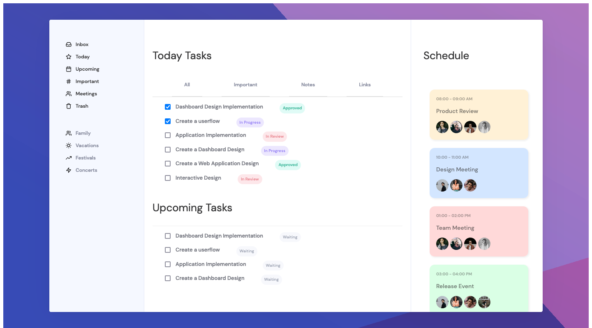

# Responsive Task Management

This day I created a Reponsive Taskboard using [Svelte](https://svelte.dev/). Heres an image of it:



You can run the code using the following commands:

```
npm install
npm run dev
```

This project is based on 30 Days of Code from [this website](https://dev.to/somanathgoudar/30dayschallenge-30-days-extreme-html-css-challenge-50k1).

Check other days for more cool sites! :D